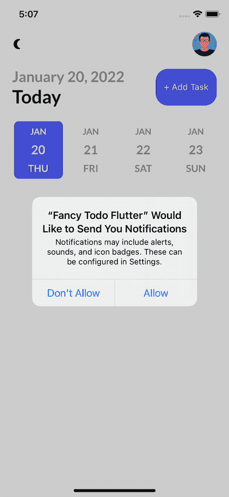

# Fancy TODOs Application (Flutter Demo)

## Demo



## Issues
- When you build iOS application using by M1, it will occur an error like below:
    ```txt
    getx m1 using `ARCHS` setting to build architectures of target `Pods-Runner`
    ```
    - As you see, the cause of the issue is the ARM architecture. Try to run lik below:
        - Close the application & remove it    
        - Run `flutter clean`
        - Run `arch -x86_64 sudo gem install ffi`
        - Get dependencies
        - Run the application
